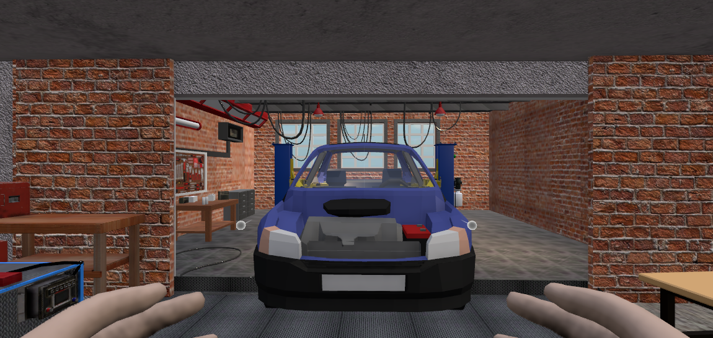
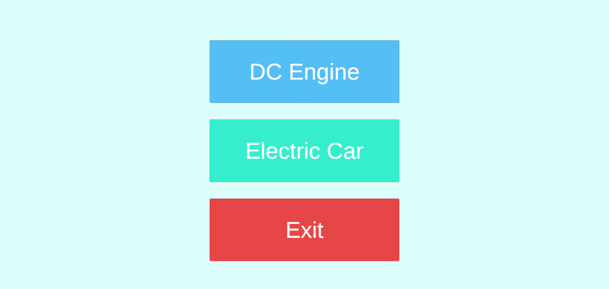
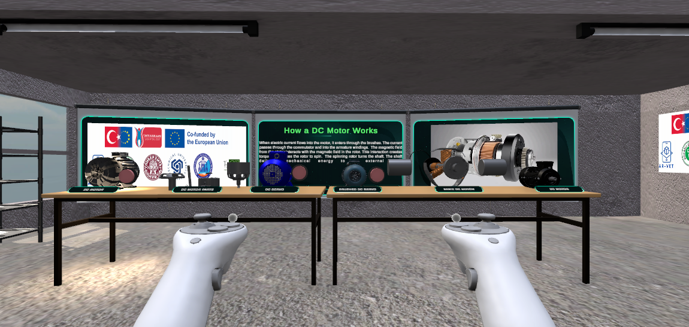
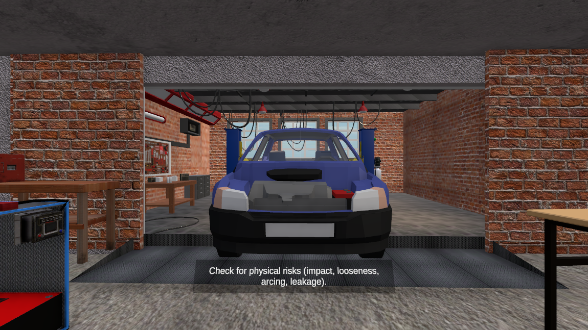

# DcEngineVR

VR training simulations for electric-vehicle maintenance, built with Unity 6 and OpenXR.

The project contains two self-contained training modules. In the first, the learner de-energizes the high-voltage system of an electric vehicle and verifies its insulation. In the second, the learner takes a DC motor apart component by component and powers it up. Both run on a shared hub scene and are designed for standing, room-scale VR with hand or controller input.



---

## Contents

- [Modules](#modules)
- [Requirements](#requirements)
- [Getting started](#getting-started)
- [Controls](#controls)
- [Project structure](#project-structure)
- [How the training flow works](#how-the-training-flow-works)
- [Development notes](#development-notes)
- [Documentation](#documentation)
- [Funding](#funding)

---

## Modules

The hub scene (`Assets/MENU.unity`) is the entry point and routes into either module.



### 1. EV High-Voltage De-energization & Insulation Test

`Assets/proje/Scenes/Araba.unity`

A repair shop with a vehicle on a two-post lift and a high-voltage battery pack inside a laboratory cage. The learner works through the two-stage protocol used in HV service: first proving the system carries no voltage, then measuring how well the HV lines are isolated from the vehicle body. Instrument validation is part of the exercise, because a meter that reports a false zero is more dangerous than no measurement at all.

Covered in six scenes: visual inspection and work-area preparation, isolating the HV system, instrument verification, absence-of-voltage test, insulation resistance measurement, and battery removal with reporting. Results are evaluated against ECE R100 (500 Ω/V).

Interactive equipment includes a two-pole HV tester, a multimeter, a gigaohmmeter, an intermediate measuring unit, the lift control panel, HV connectors, a carrier tray, and a marked safe zone.

### 2. DC Motor Construction & Operating Principle

`Assets/BasicScene.unity`

A workshop laid out with four motor stations — a standard DC motor, a set of separated motor parts, a DC servo, and a brushed DC servo — plus wall panels that explain the operating principle and play a turntable animation for each of the nine components.



The nine components follow the panel numbering: frame (housing), stator, rotor (armature), armature windings, commutator, brushes, shaft, bearings, and end covers. A cut-away motor hangs from the ceiling on two high-voltage cables; connecting both cables and pressing the panel button spins the rotor.

---

## Requirements

### Software

| | Version |
|---|---|
| Unity | **6000.0.51f1** |
| Render pipeline | Universal RP 17.3.0 |
| XR Interaction Toolkit | 3.3.1 |
| XR Hands | 1.7.3 |
| OpenXR | 1.16.1 |
| XR Management | 4.5.3 |
| Oculus XR | 4.5.4 |
| Input System | 1.17.0 |
| AR Foundation | 6.3.2 |

Unity must be installed with the **Android Build Support** module if you intend to build for a standalone headset.

### Hardware

Developed and tested against Meta Quest, both over Quest Link (PCVR) and as a standalone Android build. Enabled OpenXR features on Standalone and Android:

- Oculus Touch Controller Profile
- Hand Tracking Subsystem
- Meta Hand Tracking Aim

A headset is not required to open the project. The XR Interaction Simulator (included with the XR Interaction Toolkit samples) lets you drive the rig with mouse and keyboard in the editor.

---

## Getting started

```bash
git clone <repository-url>
cd DcEngineVR
```

1. Open the project with Unity **6000.0.51f1**. The first import takes a while — the project ships around 740 MB of assets.
2. Wait for the package manager to resolve and for scripts to compile.
3. Open `Assets/MENU.unity` and press Play. Without a headset the XR Interaction Simulator takes over the rig.

### Build settings

Three scenes are in the build, in this order:

| # | Scene | Role |
|---|---|---|
| 0 | `Assets/MENU.unity` | Hub / module selection |
| 1 | `Assets/BasicScene.unity` | DC motor module |
| 2 | `Assets/proje/Scenes/Araba.unity` | EV high-voltage module |

Menu navigation depends on this order, so keep it if you add scenes.

### Building for a standalone headset

1. `File → Build Settings → Android`, then `Switch Platform`.
2. Confirm `Project Settings → XR Plug-in Management → Android` has **OpenXR** enabled with the Meta feature group.
3. Build and deploy the APK.

---

## Controls

| Action | Controller | Hand tracking |
|---|---|---|
| Move / turn | Thumbsticks | Teleport ray |
| Grab an object | Grip | Pinch |
| Press a panel button | Point the ray, pull the trigger | Poke with the index finger |
| Open / close the task list | **X** or **Y** on the left controller (also **M** on the keyboard) | — |

The task list is hidden when a module starts. The current task is always shown as a single line of text floating in front of the learner, so the panel only needs to be opened to review progress.



### Hands vs. controllers

The EV module renders rigged hands instead of controller models. `ControllerHandPoser` drives the finger joints from the grip and trigger values, solving each joint's hinge axis from the model's own rest pose at startup, so no hand-authored poses are needed. When the learner puts the controllers down, `XRInputModalityManager` swaps to the tracked-hand visuals automatically.

The DC motor module still shows controller models — porting the hand setup to that scene is open work.

---

## Project structure

```
Assets/
├── MENU.unity                     Hub scene
├── BasicScene.unity               DC motor module
├── Araba/                         EV module assets
│   ├── scripts/                   Checklist, hand poser, cable helpers
│   └── sahne lift/                Lift, tray, HV socket, task machine
├── proje/
│   ├── Scenes/Araba.unity         EV module scene
│   ├── Scripts/                   Measurement instruments, connectors, motor control
│   └── Models/                    Environment and equipment models
├── GogoGaga/                      Rope / cable rendering package
├── Samples/                       XRI and XR Hands samples (rig, hand meshes)
├── Settings/                      URP assets and renderer data
└── XR/                            OpenXR and loader settings

Docs/                              Simulation narratives and images
```

### Key scripts

| Script | Responsibility |
|---|---|
| `VRChecklistManager` | Owns the task list, progress, active-task text, and target highlighting |
| `VRChecklistItem` | Per-item visuals: locked, active, completed |
| `TaskMenuController` | Shows and hides the hand-mounted task panel |
| `GorevYoneticisi` | Step machine for the lift and battery-removal sequence; reports completions to the checklist |
| `ControllerHandPoser` | Drives hand finger joints from controller grip/trigger input |
| `SnapTarget` | Locks a plug into its socket when it comes within range |
| `HVManager` | Tracks which HV connections are made |
| `AvometreSistemi` | Multimeter behaviour and readout |
| `MotorKontrol` / `MotorKontrolKablo` | Spin the motor rotor; the cable variant requires both cables connected first |
| `LiftController` / `LiftButonu` | Two-post lift and carrier tray movement |
| `Rope` (GogoGaga) | Spring-driven cable rendering between two points |

---

## How the training flow works

Tasks live in a single list on `VRChecklistManager`. Only one task is interactable at a time; completing it unlocks the next. The manager exposes `CompleteTask(int)` so gameplay systems can tick items off, and `SetActiveSuffix(string)` for progress counters such as `(2/3)` while HV connectors are being disconnected.

`GorevYoneticisi` runs the physical sequence for the lift and battery removal. When a checklist is assigned to it, the checklist owns the instruction text and the highlighting, and the step machine only reports completions. `taskTargets` on the manager maps each task to a scene object, which is pulsed with an emissive tint through a `MaterialPropertyBlock` while that task is active.

---

## Development notes

These are behaviours specific to this project that are easy to trip over.

**The world is built at 6× scale.** `XR Origin Hands (XR Rig)` has `localScale = (6, 6, 6)`, and the environment is modelled to match — the vehicle is roughly 33 m long in world units. One local unit under a controller equals one real metre. Do not "fix" the rig scale; convert instead: `cm = units / 6 * 100`. This also means distances such as `SnapTarget.snapRange` and light ranges have to be read at 6×.

**Two XR rigs exist in `Araba.unity`, and one is disabled.** `XR Origin (XR Rig)` is inactive; the live one is `XR Origin Hands (XR Rig)`. Any lookup that includes inactive objects can land on the dead rig, and anything parented there simply never renders.

**`Right Controller Visual` has a mirrored scale** of `(-1, 1, 1)`. Anything parented under it is mirrored too, which turns a skinned hand mesh inside out. Parent hand visuals to `Right Controller` itself.

**The active URP assets are not the ones in `Assets/Settings/*_PipelineAsset.asset`.** `GraphicsSettings` points at `Assets/Settings/Project Configuration/Performance URP Config.asset`, whose renderer is `Android Preset.asset`. If post-processing appears to do nothing, check that the renderer's `postProcessData` field is not null.

**Recompiling while the editor is in Play mode silently breaks components.** The domain reload resets non-serialized private fields but does not call `Awake` again, so anything that builds its state in `Awake` comes back dead for the rest of that play session, with no error. Stop Play before touching a script.

**Scene edits made during Play mode are discarded** when Play stops, including changes applied through tooling.

---

## Documentation

Full simulation narratives, written for instructors, live in `Docs/`:

- `1) EV High-Voltage De-energization & Insulation Test.md`
- `2) DC Motor Construction & Operating Principle.md`

Each covers the educational purpose, a scene-by-scene walkthrough, learning outcomes, and reflection questions.

---

## Funding

Produced within **AR-VET — Revolutionizing VET: AR Training for Electric Cars**.

Project number `2024-1-TR01-KA220-VET-000256976` · <https://ar-vet.net/>

Funded by the European Union. Views and opinions expressed are however those of the author(s) only and do not necessarily reflect those of the European Union or the European Education and Culture Executive Agency (EACEA). Neither the European Union nor EACEA can be held responsible for them.
